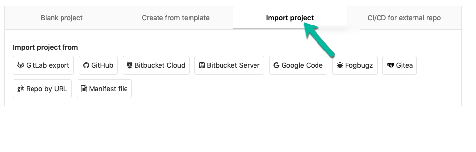
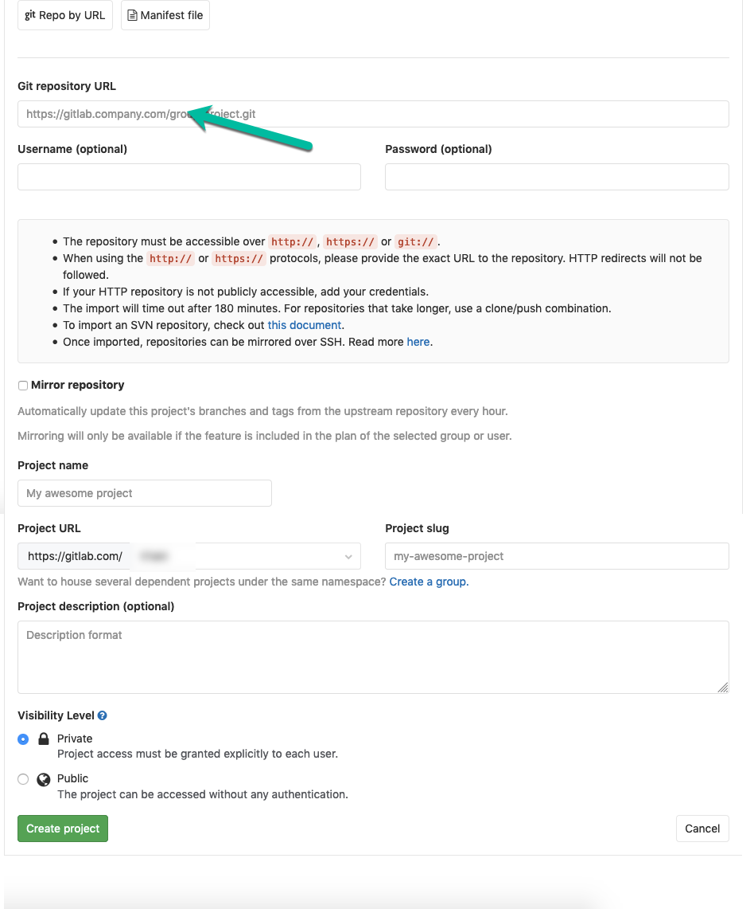
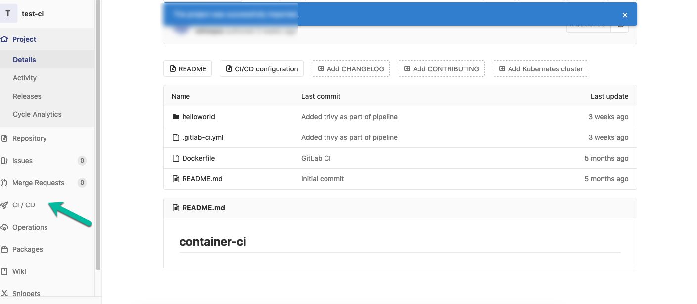
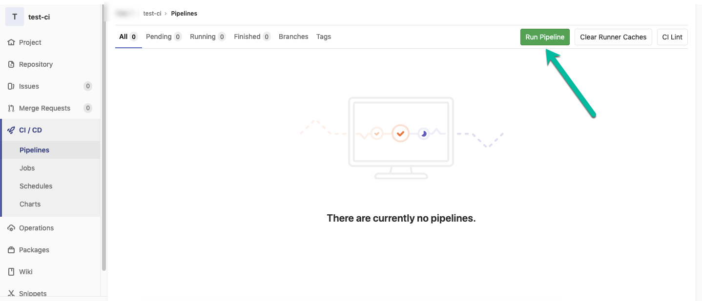
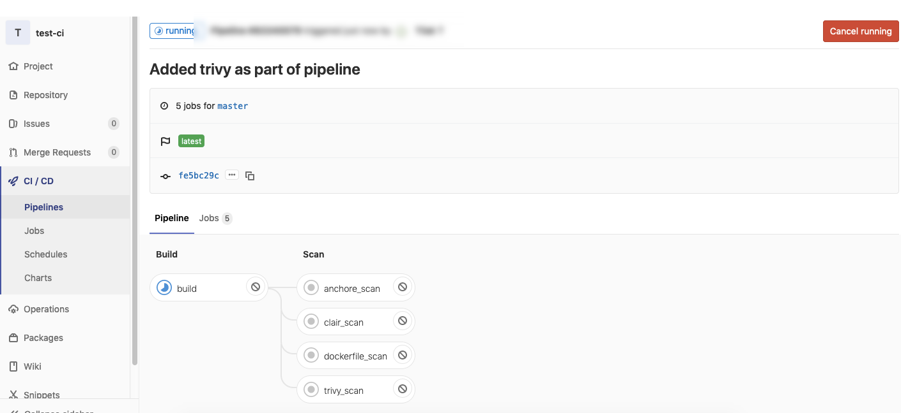
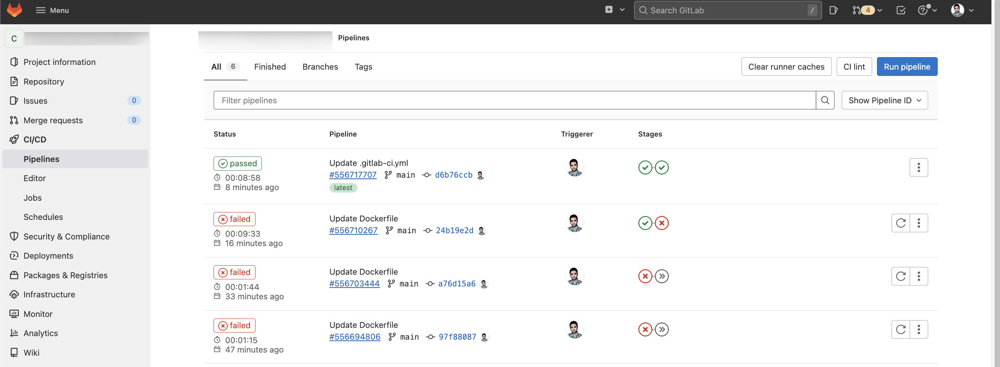

Step 1: Register/Login to gitlab

Step 2: Create a gitlab project

Step 3: Click on Import Project

Step 4: Click to Repo by URL 
and fill as the Git repository URL, specify a project name and click create the project button

    https://github.com/Security-Champions-Beta/ContainerSecurity_GitLabCI.git

Step 5: Once the repository has been imported, all files should be visible in the project.

and .gitlab-ci.yml is the file that is configured to build the docker image and run specified scans.

Step 6: Click Run Pipeline button.

Note: if it is a first time you may have to click twice Run Pipeline button.

Step 7: Wait for the pipeline to execute and observe the results

Finish :))