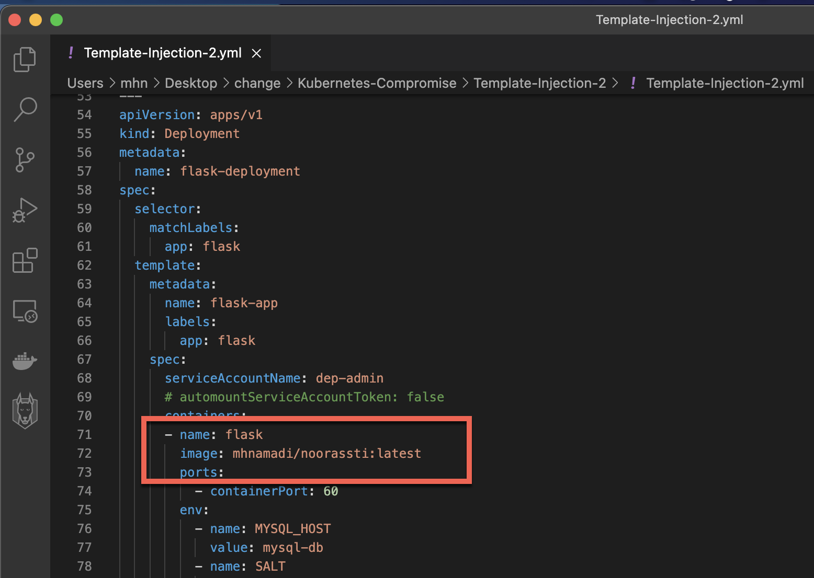
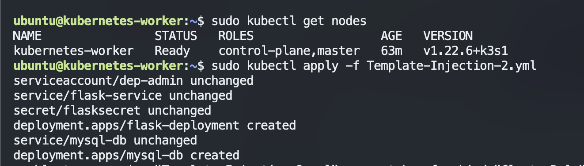
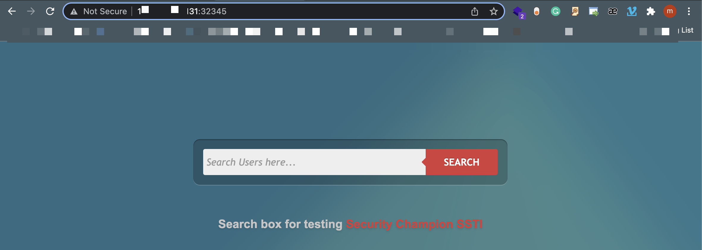
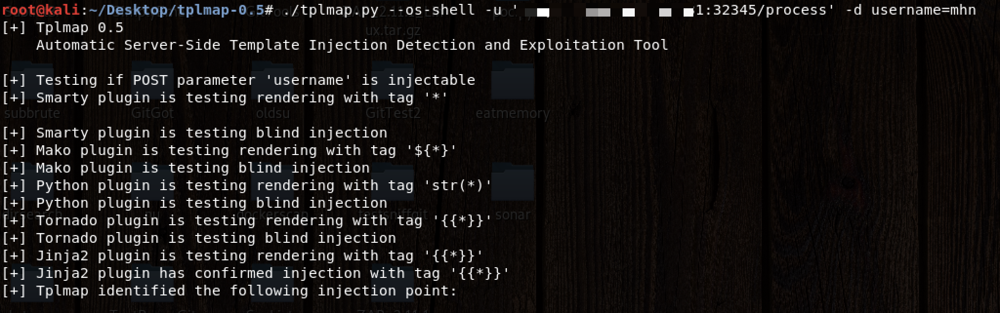
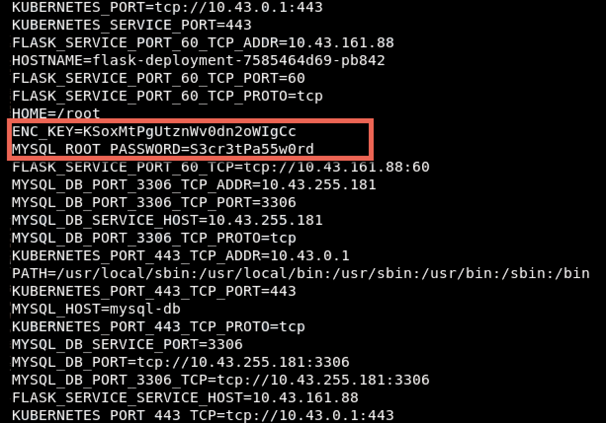

# Kubernetes-Compromise

# K8s Environment Steal Template-Injection-2

If the app blindly takes a user input (such as username) and render it into a template. Then the user can inject arbitrary code which the template will evaluate.

Such injection, will allow the user to access some APIs and methods which are not supposed to.

**How to discover the flaw❓**

Usually manually, with trial and error. If we don’t know the type of the template engine, then we inject a set of various template syntax. Portswigger provides an extensive approach to spot the vulnerability with different template types.

For this demo, I will be using Python and Jinja template.

In Jinja, 

    if you pass an operation like {{7*7}} and the app evaluated 7*7 and returned 49

Jinja2 is a full featured template engine for Python. It has full unicode support, an optional integrated sandboxed execution environment, widely used and BSD licensed.

            {{7*7}} = Error
            ${7*7} = ${7*7}
            {{foobar}} Nothing
            {{4*4}}[[5*5]]
            {{7*'7'}} = 7777777
            {{config}}
            {{config.items()}}
            {{settings.SECRET_KEY}}
            {{settings}}
            
            
## Owasp

https://owasp.org/www-project-web-security-testing-guide/v41/4-Web_Application_Security_Testing/07-Input_Validation_Testing/18-Testing_for_Server_Side_Template_Injection

## Payload 

    https://github.com/swisskyrepo/PayloadsAllTheThings/blob/master/Server%20Side%20Template%20Injection/Intruder/ssti.fuzz

## Attack HELP

    http://blog.portswigger.net/2015/08/server-side-template-injection.html
    https://github.com/epinna/tplmap/issues/9
    http://disse.cting.org/2016/08/02/2016-08-02-sandbox-break-out-nunjucks-template-engine
    https://artsploit.blogspot.co.uk/2016/08/pprce2.html
    http://jinja.pocoo.org/
    http://flask.pocoo.org/
    https://opsecx.com/index.php/2016/07/03/server-side-template-injection-in-tornado/

## Setup

yaml create

Check Nodes 

    sudo kubectl get nodes

    sudo kubectl apply -f Template-Injection-2.yml 
    

## Attack Template injection

## Compromise (K8s Environment Steal) Kubernetes Secret ENV :  

Secrets
A Secret is an object that contains a small amount of sensitive data such as a password, a token, or a key. Such information might otherwise be put in a Pod specification or in a container image. Using a Secret means that you don't need to include confidential data in your application code.

Because Secrets can be created independently of the Pods that use them, there is less risk of the Secret (and its data) being exposed during the workflow of creating, viewing, and editing Pods. Kubernetes, and applications that run in your cluster, can also take additional precautions with Secrets, such as avoiding writing confidential data to nonvolatile storage.

## Twitter & Facebook Contributor :

https://www.linkedin.com/in/mohammad-hussein-namadi-775baa131/

  
## Fix 

We encourage you to contribute to Project and Fix Codes

If you want to pull request and fix bug please follow this :

CONTRIBUTION.md

