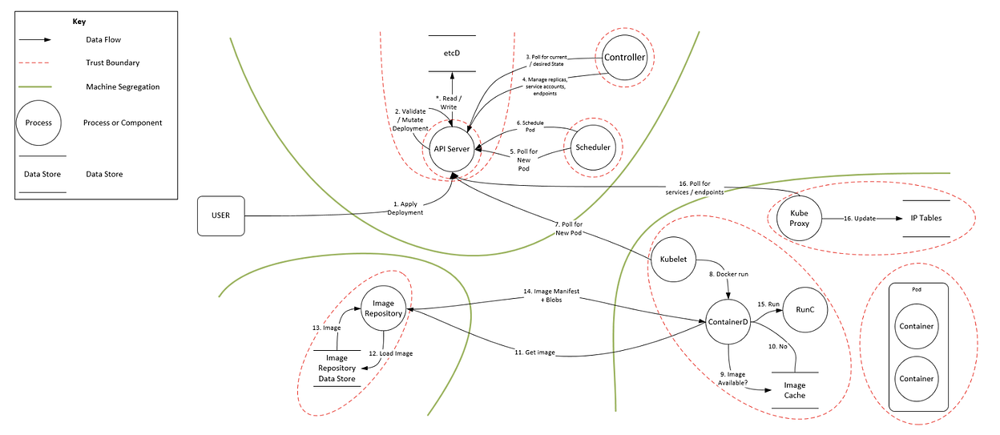

# Kubernetes-Compromise

A laborator for learning Kubernetes . 😆

In this lab we illustrate attack on Kubernetes 

## What is Kubernetes?

Kubernetes is a portable, extensible, open-source platform for managing containerized workloads and services, that facilitates both declarative configuration and automation. It has a large, rapidly growing ecosystem. Kubernetes services, support, and tools are widely available.and operations. 🚀

### Type Of Attack On Kubernetes

1. Privileged pods

2. A malicious webhook 

3. Using insecure root mounts

4. Kubernetes CronJobs/jobs

5. Denial of Service (DOS)

6. RBAC Issues

7. Establish Persistence

8. Access Sensitive Data

9. K8s Environment Steal

10. Malicious Code Execution

11. Limit Direct Access to Kubernetes Nodes

12. Controlling access to the Kubernetes API

13. API Authentication

14. Restrict access to etcd

15. Controlling access to the Kubelet

16. Securing Kubernetes Dashboard

 

